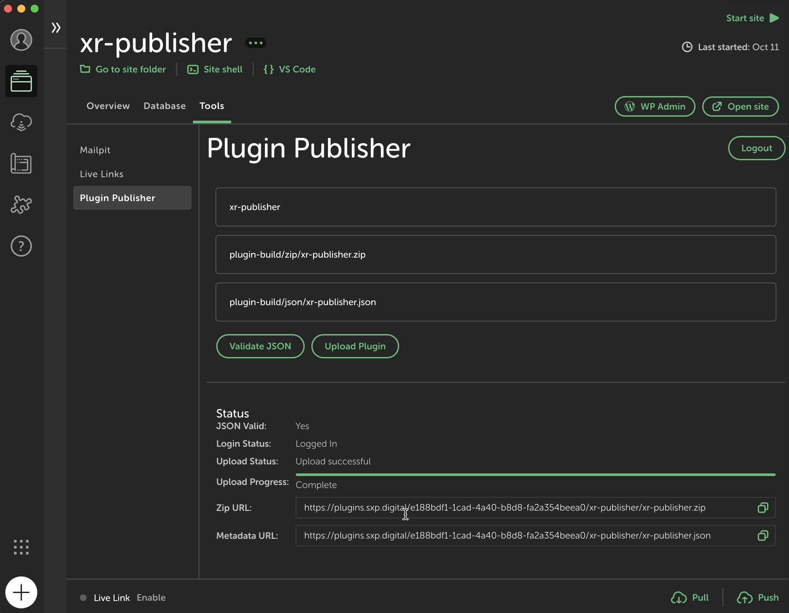

# XR Publisher Plugin Updater

This Local WP add-on enables developers to publish and update 3D plugins for WordPress that extend the "XR Publisher" plugin. It integrates with the app.xr.foundation platform for seamless plugin distribution and updates.

## What This Tool Does

The XR Publisher Plugin Updater simplifies the process of deploying and maintaining WordPress plugins specifically designed for XR (Extended Reality) applications. It provides a user-friendly interface within Local WP to:

1. Validate your plugin's metadata
2. Upload your plugin files to the SXP Digital platform's 3D plugin repo
3. Generate distribution URLs for your plugin
4. Enable automatic updates for end-users

This tool bridges the gap between local development and cloud distribution, ensuring that your XR plugins can be easily shared and kept up-to-date.



## Installation

To install the XR Publisher Plugin Updater add-on:

1. Clone this repository directly into your Local WP add-ons directory:
   - macOS: `~/Library/Application Support/Local/addons`
   - Windows: `C:\Users\username\AppData\Roaming\Local\addons`
   - Linux: `~/.config/Local/addons`

2. Navigate to the cloned directory and install dependencies:
   ```
   cd path/to/xr-publisher-plugin-updater
   yarn install
   ```
   or if you prefer npm:
   ```
   npm install
   ```

3. Build the add-on:
   ```
   yarn build
   ```
   or with npm:
   ```
   npm run build
   ```

4. Restart Local WP.

5. Enable the XR Publisher Plugin Updater add-on in Local's preferences.

If enabling the add-on via the Local UI doesn't work, you can manually enable it by updating the `enabled-addons.json` file. This file is located at:

- macOS: `~/Library/Application Support/Local/enabled-addons.json`
- Windows: `C:\Users\<username>\AppData\Roaming\Local\addons\enabled-addons.json`
- Linux: `~/.config/Local/enabled-addons.json`

Make sure the json file includes:

```json
"xr-publisher-plugin-updater": true
```

After making these changes, restart Local WP again to ensure the add-on is properly loaded.

## How to Use

### Input Fields

1. Plugin Name: 
   - Enter the name of your plugin's directory in the WordPress plugins folder.
   - Example: For a plugin located at `wp-content/plugins/my-xr-plugin`, enter `my-xr-plugin`.

2. Zip File Path: 
   - Provide the relative path to your plugin's zip file within the plugin directory.
   - Example: If the zip is at `my-xr-plugin/dist/my-xr-plugin.zip`, enter `dist/my-xr-plugin.zip`.

3. JSON File Path: 
   - Specify the relative path to your plugin's metadata JSON file.
   - Example: For a file at `my-xr-plugin/dist/metadata.json`, enter `dist/metadata.json`.

4. Assets path
   - Specify the relative path to your plugin's image asset files.
   - Example: For a file at `my-xr-plugin/dist/assets`, enter `dist/assests`.


### Custom Paths

While the add-on provides default paths, you can override these to accommodate custom build structures:

- Default Zip Path: `plugin-build/zip/[Plugin Name].zip`
- Default JSON Path: `plugin-build/json/[Plugin Name].json`

To use custom paths, simply enter your preferred paths in the respective input fields.

### Publishing Process

1. Fill in the input fields with your plugin details.
2. Click the Login buton and sign in using your credentials. If you do not have an account create one here: https://app.xr.foundation/register (DM for invite code)
2. Click "Validate JSON" to verify your metadata file.
3. If validation succeeds, the "Upload Plugin" button will appear.
4. Click "Upload Plugin" to initiate the publishing process.
5. Upon completion, you'll receive URLs for your uploaded zip file, metadata, and plugin page.

Once uploaded the add-on will provide you with a metadata url and your plugin page url. A plugin page is acessible from the following route:
`https://app.xr.foundation/plugins/<your-user-id>/<your-plugin-slug>`

Example live plugin page: https://app.xr.foundation/plugins/e188bdf1-1cad-4a40-b8d8-fa2a354beea0/xr-publisher

### Video Demo

[](https://www.youtube.com/watch?v=1oTkmDNkwyo)

### Coming soon: Author pages that list all your plugins a la Bandcamp. I want releasing plugins to feel like music drops.

## Enabling Automatic Updates

To allow users to update your plugin directly from their WordPress dashboard:

1. Include the `XR_Publisher_Updater` class in your plugin's main file.
2. Initialize the updater with your plugin's information:

Example:

```
require_once plugin_dir_path(__FILE__) . 'XR_Publisher_Updater.php';

$updater = new xrPublisher\XR_Publisher_Updater(
    'your-plugin-slug',
    plugin_basename(__FILE__),
    '1.0.0', // Your plugin's current version
    'https://example.com/your-plugin-metadata.json', // Metadata URL from the add-on
    'https://example.com/your-plugin.zip' // Zip URL from the add-on
);
```

Replace the placeholder values with your actual plugin information and the URLs provided by the Plugin Publisher add-on after uploading.

For developers looking to contribute or customize the add-on, please refer to the DEVELOPMENT.md file in the repository.