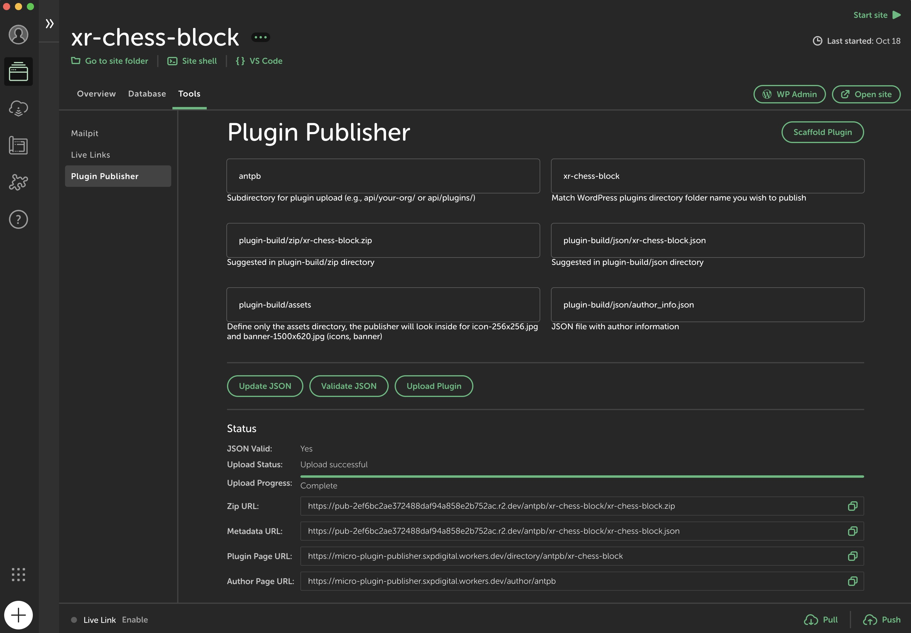
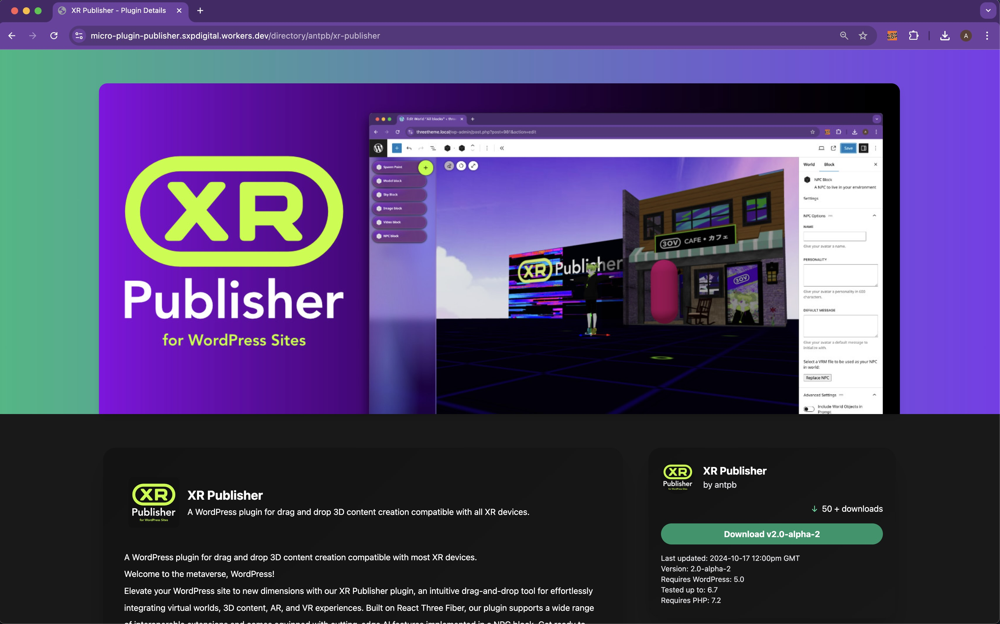
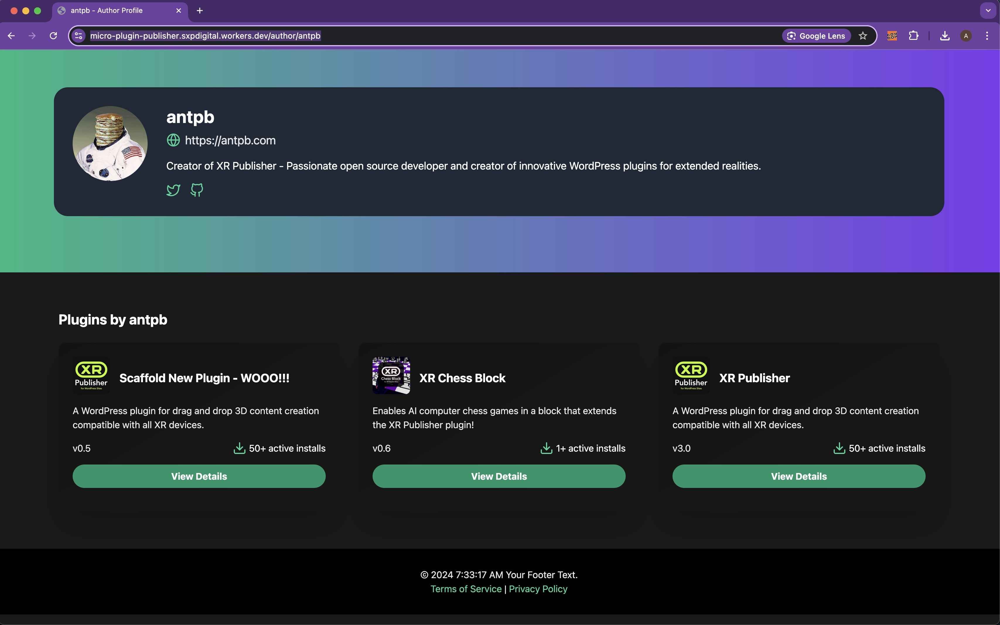
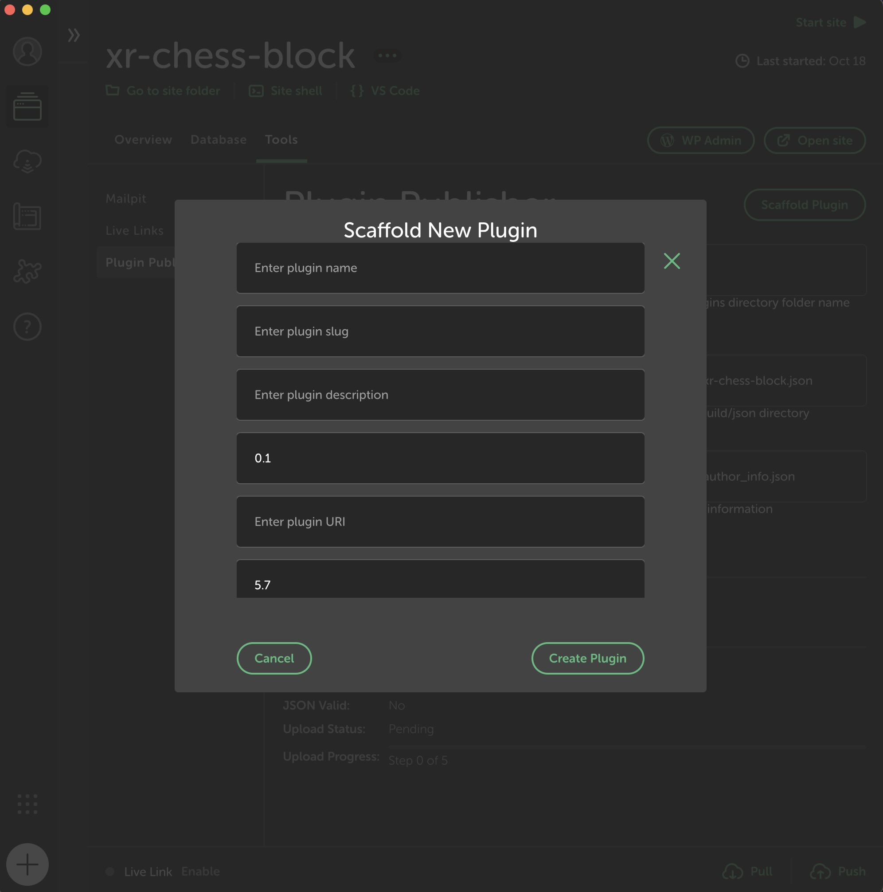

# Micro Plugin Publisher

Micro Plugin Publisher is a Local WP add-on that streamlines the process of publishing, updating, and scaffolding WordPress plugins. It provides a user-friendly interface within Local WP and includes API tooling for self-hosted plugin distribution.

- API Setup: [`Plugin Publisher API Setup`](api/README.md)



## Features

- Scaffold new WordPress plugins
- Validate plugin metadata
- Update plugin JSON files
- Upload plugin files to your own storage solution
- Generate distribution URLs for your plugins
- Enable automatic updates for end-users
- Self-hosted API for plugin distribution
- Auto Generated Plugin page and Author pages
- Cache that adjusts when publishing new updates
- Backup solution for versioining



Example Plugin Page:
https://micro-plugin-publisher.sxpdigital.workers.dev/directory/antpb/xr-publisher



Example Author Page:
https://micro-plugin-publisher.sxpdigital.workers.dev/author/antpb

Example 

## Installation

1. Clone this repository into your Local WP add-ons directory:
   ```
   git clone git@github.com:xpportal/Micro-Plugin-Publisher.git
   ```
   ### Clone Locations

   - macOS: ~/Library/Application Support/Local/addons
   - Windows: C:\Users\username\AppData\Roaming\Local\addons
   - Debian Linux: ~/.config/Local/addons

   *You can replace 'Local' with 'Local Beta' if you want to create the add-on for Local Beta.*

2. Install dependencies:
   ```
   cd micro-plugin-publisher
   yarn install
   ```

3. Build the add-on:
   ```
   yarn build
   ```

4. Restart Local WP and enable the Micro Plugin Publisher add-on in preferences.

## Usage

1. In the add-on interface, you can:
   - Scaffold a new plugin
   - Enter details for an existing plugin:
     - Sub Directory
     - Plugin Name
     - Zip File Path
     - JSON File Path
     - Assets Path
     - Author Info File Path

2. Use the "Scaffold Plugin" button to create a new plugin structure.




3. For existing plugins:
   - Click "Update JSON" to update the JSON file with the anticipated file paths.
   - Click "Validate JSON" to check the JSON file's validity.
   - If validation is successful, click "Upload Plugin" to start the publishing process.
   - If you are adapting an existing plugin ensure that there is a `.env` and `plugin-build` directory. Reference the examples directory to see an example expected directory structure. `plugin-build` must contain an `assets`, `zip`, and `json`, directory unless otherwise stated in your input field paths in the addon.

### File Access

The addon looks for your files in the Local by Flywheel site structure:

~/Local Sites/[Plugin Name]/app/public/wp-content/plugins/[Plugin Name]/

### Publishing Process

1. Enter plugin information into the input fields.
2. Update the JSON file using the "Update JSON" button.
3. Validate the JSON file.
4. If validation is successful, upload the plugin.
5. The addon will provide you with URLs for the uploaded zip file and metadata.

## Version Checking and Backup

The Micro Plugin Publisher includes an automated version checking and backup mechanism to prevent accidental overwrites and maintain version history:

1. **Version Check**: Before uploading a new version of a plugin, the system compares the local info json defined version number with the existing version on the server.

2. **Backup Creation**: If the new version is higher than the existing one, the addon automatically creates a backup of the current version before proceeding with the upload.

3. **Backup Storage**: Backups are stored in a folder named with the version number, containing all relevant files (JSON metadata, ZIP file, and assets).

4. **Upload Prevention**: The system prevents uploads if:
   - The new version is the same as or lower than the existing version.
   - The backup creation process fails for any reason.

5. **Workflow**:
   - The system first checks the version using the `/plugin-data` endpoint.
   - If a higher version is detected, it calls the `/backup-plugin` endpoint to create a backup.
   - Only after successful backup creation does the upload process continue.

This mechanism ensures that:
- Users cannot accidentally overwrite their plugins with older or identical versions.
- A history of plugin versions is maintained, allowing for easy rollback if needed.
- The integrity of the plugin versioning system is preserved.

To use this feature, ensure your plugin's metadata includes a valid `version` field, following semantic versioning principles (e.g., "1.0.0", "2.1.3").

Note: This process happens automatically during the plugin upload process and requires no additional action from the user beyond providing the correct version number in the plugin metadata that is located in the `plugin-build/json` folder.

## API Setup: [`Setup Instructions Here`](api/README.md)

To set up your own plugin distribution API:

1. Navigate to the `api` directory.
2. Follow the instructions in [`api/README.md`](api/README.md) to deploy the worker and R2 bucket using Cloudflare.

## Enabling Automatic Updates

To enable automatic updates for your plugin, implement the update mechanism in your plugin's PHP code:

1. Include the `Micro_Plugin_Publisher_Updater` class in your plugin:

   ```php
   require_once plugin_dir_path(__FILE__) . 'class-example-upgrader.php';
   ```

2. Initialize the updater in your plugin's main file:

   ```php
	// Example usage of upgrader class
	require_once dirname(__FILE__) . 'class-example-upgrader.php';
	
	function initialize_Micro_Plugin_Publisher_Updater() {
		$plugin_slug = 'xr-publisher-three-icosa';
		$plugin_name = plugin_basename(__FILE__);
		$version = '0.1';
		$metadata_url = 'https://pub-2ef6bc2ae372488daf94a858e2b752ac.r2.dev/plugins/xr-publisher-three-icosa/xr-publisher-three-icosa.json';
		$zip_url = 'https://pub-2ef6bc2ae372488daf94a858e2b752ac.r2.dev/plugins/xr-publisher-three-icosa/xr-publisher-three-icosa.zip';
		new MicroUpgrader\Micro_Plugin_Publisher_Updater($plugin_slug, $plugin_name, $version, $metadata_url, $zip_url);
	}
	add_action('plugins_loaded', 'initialize_Micro_Plugin_Publisher_Updater');
   ```

3. Replace the placeholder values with your actual plugin information and URLs provided by the Micro Plugin Publisher add-on after uploading.

## Environment Variables

The addon uses environment variables for API configuration. Ensure you have a `.env` file in your plugin directory with the following variables:

- `API_KEY`: Your API key for authentication
- `PLUGIN_API_URL`: The URL of your plugin API
- `BUCKET_URL`: The URL of your storage bucket

## Customization

- Modify the add-on's UI in `src/JSONValidatorUploader.jsx`
- Adjust the main process logic in `src/main.ts`
- Customize API functionality in `api/src/worker.js`
- Adapt the `Micro_Plugin_Publisher_Updater` class to fit your specific needs

## Contributing

Contributions are welcome! Please submit issues and pull requests on the GitHub repository.

## License

This project is licensed under the MIT License. See the LICENSE file for details.

## Support

For issues or assistance:

1. Check the Troubleshooting section in api/README.md
2. Open an issue on the GitHub repository
3. Consult the Local WP documentation for add-on related queries