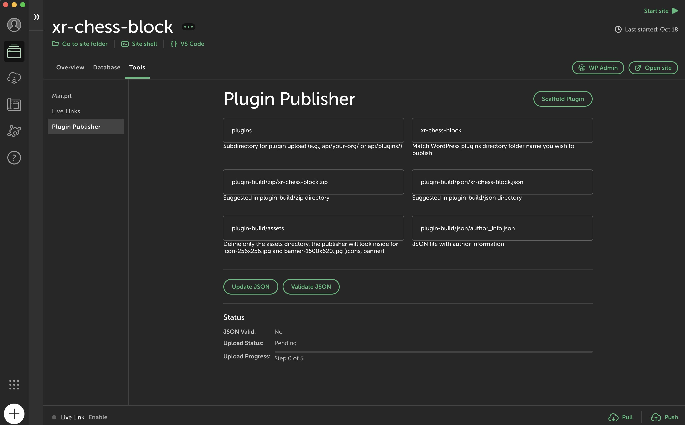

# Micro Plugin Publisher

Micro Plugin Publisher is a Local WP add-on that streamlines the process of publishing and updating WordPress plugins. It provides a user-friendly interface within Local WP and includes API tooling for self-hosted plugin distribution.



## Features

- Validate plugin metadata
- Upload plugin files to your own storage solution
- Generate distribution URLs for your plugins
- Enable automatic updates for end-users
- Self-hosted API for plugin distribution

## Installation

1. Clone this repository into your Local WP add-ons directory:
   ```
   git clone https://github.com/yourusername/micro-plugin-publisher.git
   ```

2. Install dependencies:
   ```
   cd micro-plugin-publisher
   yarn install
   ```

3. Build the add-on:
   ```
   yarn build
   ```

4. Restart Local WP and enable the Micro Plugin Publisher add-on in preferences.

## Usage

1. Fill in the plugin details in the add-on interface:
   - Plugin Name
   - Zip File Path
   - JSON File Path
   - Assets Path

2. Click "Validate JSON" to verify your metadata.
3. If validation succeeds, click "Upload Plugin" to publish.
4. You'll receive URLs for your uploaded zip file, metadata, and plugin page.

## API Setup

To set up your own plugin distribution API:

1. Navigate to the `api` directory.
2. Follow the instructions in `API_SETUP.md` to deploy the worker and R2 bucket using Cloudflare.

## Enabling Automatic Updates

To enable automatic updates for your plugin, you need to implement the update mechanism in your plugin's PHP code. Here's how to do it:

1. Include the `Micro_Plugin_Publisher_Updater` class in your plugin:

   ```php
   require_once plugin_dir_path(__FILE__) . 'Micro_Plugin_Publisher_Updater.php';
   ```

2. Initialize the updater in your plugin's main file:

   ```php
   function initialize_plugin_updater() {
       $plugin_slug = 'your-plugin-slug';
       $plugin_name = plugin_basename(__FILE__);
       $version = 'YOUR_PLUGIN_VERSION';
       $metadata_url = 'https://your-api.com/plugin-metadata.json';
       $zip_url = 'https://your-api.com/plugin-download.zip';
       new \xrPublisher\Micro_Plugin_Publisher_Updater($plugin_slug, $plugin_name, $version, $metadata_url, $zip_url);
   }
   add_action('init', 'initialize_plugin_updater');
   ```

3. Make sure to replace the placeholder values with your actual plugin information and URLs provided by the Micro Plugin Publisher add-on after uploading.

The `Micro_Plugin_Publisher_Updater` class handles the communication with WordPress to check for updates and provide update information. It compares the current plugin version with the version available on your server and facilitates the update process when a new version is available.

## Customization

- Modify the add-on's UI in `src/renderer/index.jsx`
- Adjust the main process logic in `src/main/index.js`
- Customize API functionality in `api/src/index.js`
- Adapt the `Micro_Plugin_Publisher_Updater` class to fit your specific needs

## Contributing

Contributions are welcome! Please submit issues and pull requests on the GitHub repository.

## License

This project is licensed under the MIT License. See the LICENSE file for details.

## Support

For issues or assistance:

1. Check the Troubleshooting section in API_SETUP.md
2. Open an issue on the GitHub repository
3. Consult the Local WP documentation for add-on related queries