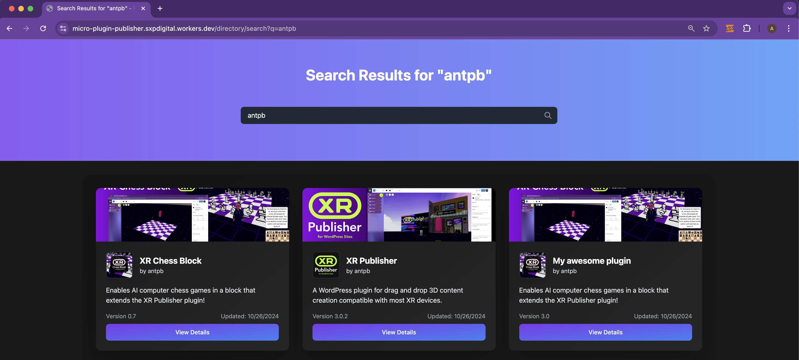
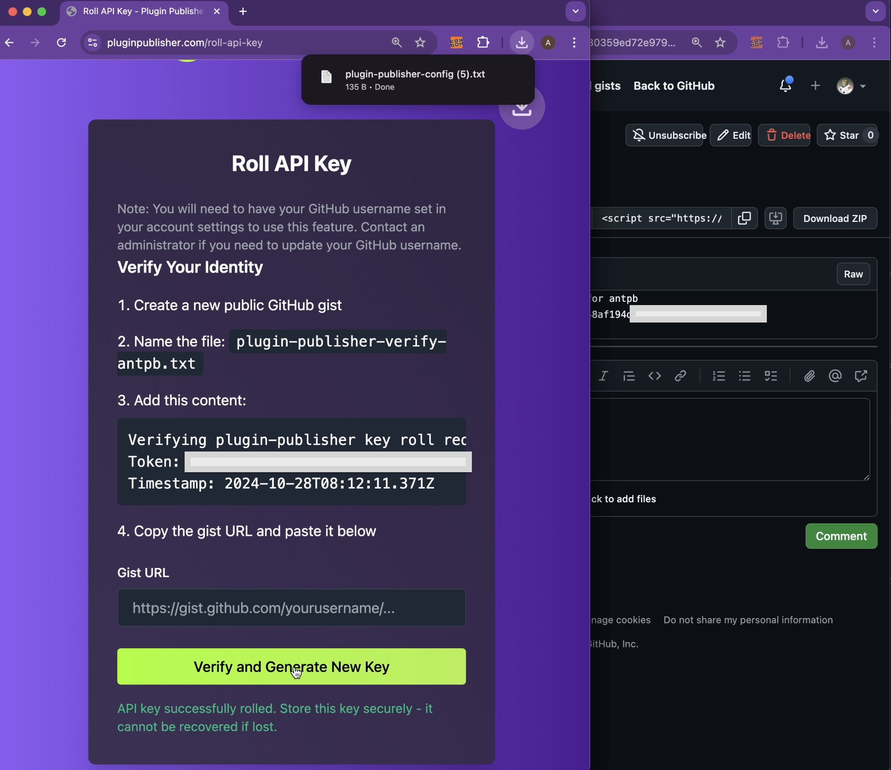

# Plugin Publishing System

## Overview

The Plugin Publishing System is a streamlined solution for managing and distributing plugins using Cloudflare Workers and R2 storage. This system allows you to easily upload, version, and distribute plugins for your platform.

## Prerequisites

Before you begin, ensure you have the following:

- A Cloudflare account with Workers and R2 enabled
- [Node.js](https://nodejs.org/) (version 12 or later) and npm installed
- [Wrangler CLI](https://developers.cloudflare.com/workers/wrangler/get-started/) installed and authenticated with your Cloudflare account

## Quick Start

1. Run the setup script:
   ```
   ./setup.sh
   ```

2. Follow the prompts to complete the setup process.

3. The API key given at the end of setup is used to publish. This key should be in the root of your project directory as `API_KEY=<yourkey>` (and omit the `.env` file from version control) One workflow tip I would recommend is rolling the key on every publish so your stored credentials at .env are constantly out of sync after deploy. 

## Detailed Setup Instructions

1. Ensure you're logged in to your Cloudflare account via Wrangler:
   ```
   npx wrangler login
   ```

2. Run the `setup.sh` script and provide a name for your project when prompted.

3. The script will:
   - Generate or update the `wrangler.toml` configuration file
   - Create an R2 bucket for storing plugin files
   - Prompt you to select the appropriate Cloudflare account (if you have multiple)
   - Deploy the existing worker code from `src/index.js`
   - Generate and set an API secret

4. After the script completes, you'll receive:
   - The R2 Bucket URL
   - An API Secret (save this securely)

5. Your worker is now deployed with the implementation from `src/index.js`.

## Configuration

The `wrangler.toml` file in your project directory contains the configuration for your worker and R2 bucket. Key configurations include:

- `name`: The name of your worker (`micro-plugin-publisher`)
- `main`: The entry point of your worker code (`src/worker.js`)
- `compatibility_date`: The date for compatibility (`2024-10-25`)
- `compatibility_flags`: Flags for compatibility (`["nodejs_compat"]`)
- `account_id`: Your Cloudflare account ID (`95d5ca589c39bf4189b080cfc8417c8e`)

### KV Namespaces
- `DOWNLOAD_COUNTS`:
- `DOWNLOAD_RATELIMIT`:
- `DOWNLOAD_QUEUE`:

### Durable Objects used for Plugin Registry and Auth database.
- `PLUGIN_REGISTRY`: Class name (`PluginRegistryDO`)
- `USER_AUTH`: Class name (`UserAuthDO`)

### Variables
- `PLUGIN_BUCKET_URL`: The URL of your R2 bucket

### R2 Buckets
- `PLUGIN_BUCKET`: Bucket name for plugin storage

## Usage

The Plugin Publishing System provides the following endpoints:

### GET Endpoints
- `/`: Homepage with author listings
- `/plugin-data`: Retrieve plugin data (cached)
- `/author-data`: Retrieve author data (cached)
- `/authors-list`: Get a list of all authors (cached)
- `/directory/{author}/{slug}`: Get the HTML page for a specific plugin (cached)
- `/author/{author}`: Get the HTML page for a specific author (cached)
- `/version-check`: Compare new version against author/slug/slug.json
- `/download`: Download a plugin file
- `/download-count`: Get download count for a plugin
- `/search`: Search plugins with optional tag filtering
- `/directory/search`: Get HTML search results page
- `/activate`: Record plugin activation
- `/activation-count`: Get activation count for a plugin
- `/register`: Get registration page HTML
- `/roll-api-key`: Get API key roll interface
- `/roll-key-with-token`: Complete key roll with verification token
- `/clear-cache`: Public cache clearing endpoint

### POST Endpoints
- `/create-user`: Register new user (no auth required, needs invite code)
- `/delete-user`: Remove user and associated data (admin only)
- `/rotate-key`: Standard API key rotation
- `/admin-update-user`: Update user details (admin only)
- `/initiate-key-roll`: Start key recovery process
- `/verify-key-roll`: Complete key recovery with GitHub verification
- `/migrate-data`: Migrate existing data to SQLite database
- `/migrate-authors`: Migrate author data to new format
- `/delete-plugin`: Remove a specific plugin
- `/delete-author`: Remove an author and all associated data
- `/record-download`: Record a plugin download
- `/plugin-upload-chunk`: Upload a chunk of a plugin file
- `/plugin-upload-json`: Upload JSON metadata for a plugin
- `/plugin-upload-assets`: Upload plugin assets (icons, banners)
- `/plugin-upload-complete`: Finalize a plugin upload
- `/update-author-info`: Update author information
- `/backup-plugin`: Create backup of currently live files
- `/clear-cache`: Clear cached responses (authenticated)

### Authentication Requirements

Most POST endpoints require authentication via API key in the Authorization header:

```bash
curl -X POST https://your-worker.dev/endpoint \
  -H "Authorization: Bearer YOUR_API_KEY" \
  -H "Content-Type: application/json"
```

`POST` Exceptions (no auth required):
- `/create-user`
- `/register`
- `/initiate-key-roll`
- `/verify-key-roll`
- `/search`

Admin-only endpoints require the main API secret:
```bash
curl -X POST https://your-worker.dev/admin-update-user \
  -H "Authorization: Bearer YOUR_API_SECRET" \
  -H "Content-Type: application/json"
```

### Caching Behavior

All GET endpoints that return HTML or JSON data are cached at the edge with a 1-hour TTL. Cache can be bypassed by:
- Including a valid API key in the request
- Using the `/clear-cache` endpoint
- Uploading new content (automatic cache invalidation)

## Caching

The API implements caching for all GET requests. Features include:
- CDN edge caching with 1-hour TTL
- Version-based cache keys
- Automatic cache invalidation on content updates 
- Auth-based cache bypassing when using API secret

Cached responses are automatically invalidated when:
- A new plugin is published
- Author information is updated
- A GET request contains a valid API secret

## Version Control and Backup

The Plugin Publishing System includes a robust version checking and backup mechanism to ensure data integrity and prevent accidental overwrites.

### Version Checking

The system uses semantic versioning to manage plugin versions. Before any upload, a version check is performed:

- Endpoint: `GET /version-check`
- Query parameters: 
  - `author`: The plugin author's identifier
  - `pluginName`: The name of the plugin
  - `newVersion`: The version being uploaded
- Response: 
  ```json
  {
    "isNew": boolean,
    "canUpload": boolean,
    "currentVersion": string
  }
  ```

This endpoint determines if the new version can be uploaded based on the existing version in the system. It prevents uploading of older or identical versions.

### Backup Creation

Before updating an existing plugin, the system creates a backup of the current version:

- Endpoint: `POST /backup-plugin`
- Request body:
  ```json
  {
    "author": string,
    "slug": string,
    "version": string
  }
  ```
- Response: Success or failure message

The backup process:
1. Creates a new folder named with the current version number.
2. Copies the current plugin files (JSON metadata, ZIP file, and assets) into this backup folder.
3. Updates the main plugin metadata to reflect the current version.

If a backup already exists for the given version, the endpoint returns a message indicating so without creating a duplicate backup.

## Search and SQLite Database

This system uses a SQLite database within a Durable Object to provide search functionality and efficient plugin management. The database automatically syncs with the R2 storage system when plugins are uploaded or updated.

### Search Endpoints

The system provides a search endpoint:

```bash
# Basic search
curl 'https://your-worker.workers.dev/search?q=pluginname'

# Search by tag
curl 'https://your-worker.workers.dev/search?tag=xr'

# Combined search with pagination
curl 'https://your-worker.workers.dev/search?q=pluginname&tag=xr&limit=20&offset=0'
```

Search parameters:
- `q`: Text to search for (searches across name, description, and author)
- `tag`: Filter by tag (can be specified multiple times)
- `limit`: Maximum number of results (default: 20)
- `offset`: Pagination offset (default: 0)

HTML Interface:
The system also provides a browser-friendly search interface at /directory/search with:

- Real-time search results
- Tag filtering
- Grid view of plugins with:
	- Banner images
	- Plugin icons
	- Version info
	- Last update date
	- Author attribution
	- Pagination controls
	- Direct links to plugin detail pages





### Database Schema

The SQLite database contains three main tables:

```sql
-- Plugin metadata table
CREATE TABLE plugins (
  id INTEGER PRIMARY KEY AUTOINCREMENT,
  author TEXT NOT NULL,
  slug TEXT NOT NULL,
  name TEXT NOT NULL,
  short_description TEXT,
  version TEXT NOT NULL,
  download_count INTEGER DEFAULT 0,
  created_at TIMESTAMP DEFAULT CURRENT_TIMESTAMP,
  updated_at TIMESTAMP DEFAULT CURRENT_TIMESTAMP,
  UNIQUE(author, slug)
);

-- Plugin tags for search
CREATE TABLE plugin_tags (
  plugin_id INTEGER,
  tag TEXT NOT NULL,
  FOREIGN KEY(plugin_id) REFERENCES plugins(id),
  PRIMARY KEY(plugin_id, tag)
);

-- Download tracking queue
CREATE TABLE download_queue (
  id INTEGER PRIMARY KEY AUTOINCREMENT,
  plugin_id INTEGER,
  timestamp TIMESTAMP DEFAULT CURRENT_TIMESTAMP,
  processed BOOLEAN DEFAULT FALSE,
  FOREIGN KEY(plugin_id) REFERENCES plugins(id)
);
```

### Initial Database Setup

After deploying, you'll need to migrate your existing plugins to the SQLite database:

```bash
# Migrate existing data from R2 to SQLite
curl -X POST https://your-worker.workers.dev/migrate-data \
  -H "Authorization: Bearer YOUR_API_KEY"
```

### Download Tracking

Downloads are tracked in a queue system to ensure accurate counting under high load:
1. Records each download in the queue
2. Processes downloads in batches
3. Updates plugin download counts safely through Durable Objects
4. Maintains consistency under concurrent access

The queue system prevents:
- Race conditions during updates
- Lost download counts under high load
- Data inconsistency across zones

### Configuration

To enable the SQLite functionality, your `wrangler.toml` needs:

```toml
[[durable_objects.bindings]]
name = "PLUGIN_REGISTRY"
class_name = "PluginRegistryDO"

[[migrations]]
tag = "v1"
new_sqlite_classes = ["PluginRegistryDO"]
```

This binds the Durable Object to your worker and enables SQLite for the database.

### Implementation Details

- Backups are stored in the same R2 bucket as the main plugin files, organized by version.
- The system uses a `compareVersions` function to ensure proper version ordering.
- Version checking and backup creation are integral steps in the plugin upload process.

These features ensure:
- Data integrity by preventing accidental overwrites.
- Version history maintenance for each plugin.
- The ability to rollback to previous versions if needed.

Rate Limiting:
- IP-based rate limiting using Cloudflare KV
- 5 downloads per hour per IP/plugin combination

Chunked Uploads:
Large plugin files are handled through chunked uploads. The system:
- Splits files into manageable chunks
- Handles upload interruption/resume
- Validates chunk integrity
- Cleans up incomplete uploads
- Processes chunks using format `{folderName}/chunks_{pluginName}/{pluginName}_chunk_{number}_{total}`


When using the API to upload or update plugins, always include the version information and follow the workflow of checking versions and creating backups before finalizing uploads.

## Customizing Author Plugin and Search Pages

Pages can be customized by modifying the `generate<type>HTML` function in each worker template file. To customize your author page:

1. Edit the `src/authorTemplate.js` file (or create it if it doesn't exist).
2. Implement your custom HTML generation logic. For example:

   ```javascript
   export default function generateAuthorHTML(authorData) {
     return `
       <!DOCTYPE html>
       <html lang="en">
       <head>
         <meta charset="UTF-8">
         <meta name="viewport" content="width=device-width, initial-scale=1.0">
         <title>${authorData.username}'s Plugins</title>
         <style>
           /* Add your custom CSS here */
         </style>
       </head>
       <body>
         <header>
           <h1>${authorData.username}</h1>
           
         </header>
         <main>
           <h2>About</h2>
           <p>${authorData.bio || 'No bio provided.'}</p>
           <h2>Plugins</h2>
           <ul>
             ${authorData.plugins.map(plugin => `
               <li>
                 <h3>${plugin.name}</h3>
                 <p>${plugin.short_description}</p>
                 <a href="/directory/${authorData.username}/${plugin.slug}">View Plugin</a>
               </li>
             `).join('')}
           </ul>
         </main>
       </body>
       </html>
     `;
   }
   ```

3. Deploy your changes using:
   ```
   npx wrangler deploy
   ```

Remember to clear the cache for your author page after making changes to see the updates immediately. You can bust the cache by hitting the upload plugin button in the Local Addon. In theory this directory should never be out of sync with the latest.

## Customization

To modify the worker's functionality:

1. Edit the `src/index.js` file.
2. Deploy your changes using:
   ```
   npx wrangler deploy
   ```

## Security Considerations

- Keep your API Secret secure. It's used to authenticate requests to your Plugin Publishing System.
- Regularly rotate your API Secret to maintain security.
- Ensure your Cloudflare account has appropriate security measures in place, such as two-factor authentication.

### Content Security
- CSP headers with nonce-based script execution
- HTML sanitization for user-provided content
- URL and resource validation
- Tag and attribute whitelisting

## User Management

The Plugin Publishing System includes a robust user management system with secure registration, API key management, and GitHub-based verification.

### Registration

New users can register through the `/register` endpoint which provides a web interface for:
- Creating a new author account
- Setting up GitHub integration
- Generating initial API credentials
- Requiring invite codes for controlled access

Registation workflow:
1. User visits the registration page
2. Provides username, email, GitHub username, and invite code
3. System validates credentials and invite code
4. Generates initial API key
5. Downloads configuration file with credentials

### API Key Management

The system provides several methods for managing API keys:

#### Standard Key Rotation
- Endpoint: `POST /rotate-key`
- Requires current API key authentication
- Generates new credentials immediately
- Invalidates previous key

#### GitHub-Based Key Recovery
For users who need to recover access, the system provides a secure GitHub-based verification:

1. **Initiate Recovery**
   - Endpoint: `POST /initiate-key-roll`
   - Required fields:
     ```json
     {
       "username": "string",
       "email": "string"
     }
     ```
   - Returns verification instructions and token

2. **Create Verification Gist**
   - User creates a public GitHub gist
   - Filename must match pattern: `plugin-publisher-verify-{username}.txt`
   - Content must include provided verification token

3. **Complete Verification**
   - Endpoint: `POST /verify-key-roll`
   - Required fields:
     ```json
     {
       "gistUrl": "string",
       "verificationToken": "string"
     }
     ```
   - System verifies:
     - Gist ownership matches registered GitHub username
     - Verification token is valid and not expired
     - File content matches expected format
   - Returns new API key upon successful verification




### User Authentication Endpoints

| Endpoint | Method | Description | Auth Required |
|----------|---------|-------------|---------------|
| `/register` | GET | Registration page | No |
| `/create-user` | POST | Create new user account | No (requires invite code) |
| `/rotate-key` | POST | Standard key rotation | Yes |
| `/roll-api-key` | GET | Key recovery interface | No |
| `/initiate-key-roll` | POST | Start recovery process | No |
| `/verify-key-roll` | POST | Complete recovery process | No |

### Security Considerations in Designing this System

- **Rate Limiting**: Prevents brute force attempts
- **Invite Code System**: Controls user registration with a simple wrangler command to roll it
- **GitHub Verification**: Links accounts to GitHub users
- **Secure Key Generation**: Uses cryptographic random values
- **Short-lived Verification Tokens**: Expires after 1 hour (considering lowering to much lower, like 5 minutes tbd...)
- **Atomic Key Updates**: Prevents race conditions during key changes

### Key Configuration

The system generates a configuration file (`plugin-publisher-config.txt`) containing:
```
API_KEY=username.keyid
PLUGIN_API_URL=https://pluginpublisher.com
BUCKET_URL=https://assets.pluginpublisher.com
```

### Best Practices

1. **API Key Security**
   - Store API keys securely
   - Never commit keys to version control
   - Rotate keys regularly
   - Use environment variables for key storage

2. **Recovery Preparation**
   - Keep email address up to date
   - Maintain accurate GitHub username in profile
   - Document recovery process for team members

3. **GitHub Integration**
   - Use a personal GitHub account
   - Ensure gists are publicly accessible
   - Maintain same GitHub username as registered

### Troubleshooting

Some imagined issues and solutions:

1. **Registration Failed**
   - Verify invite code is valid
   - Check if username/email already exists
   - Ensure GitHub username is accurate

2. **Key Recovery Issues**
   - Confirm email matches registration
   - Verify GitHub username ownership
   - Check gist visibility settings
   - Ensure verification token hasn't expired

3. **API Key Errors**
   - Verify key format (username.keyid)
   - Check if key has been rotated
   - Confirm proper environment configuration

### Administrative Functions

For system administrators:

- **User Management**
  ```bash
  # Update user details
  curl -X POST https://your-worker.dev/admin-update-user \
    -H "Authorization: Bearer YOUR_ADMIN_SECRET" \
    -H "Content-Type: application/json" \
    -d '{"username":"user","github_username":"ghuser","email":"new@email.com"}'
  ```

- **User Deletion**
  ```bash
  # Remove user and associated data
  curl -X POST https://your-worker.dev/delete-user \
    -H "Authorization: Bearer YOUR_ADMIN_SECRET" \
    -H "Content-Type: application/json" \
    -d '{"username":"user"}'
  ```

## Troubleshooting

1. **Wrangler not found**: Ensure Wrangler is installed globally: `npm install -g wrangler`
2. **Deployment fails**: Verify you're logged in to your Cloudflare account: `npx wrangler login`
3. **R2 bucket creation fails**: Confirm R2 is enabled for your Cloudflare account
4. **API requests fail**: Double-check you're using the correct API Secret in your requests

## Limitations

- The setup script assumes you have the necessary permissions to create resources and deploy workers in your Cloudflare account.
- The script does not provide options for cleaning up resources if the setup fails midway.
- Existing resources with the same names may be overwritten without warning.
- Caching is set to a fixed duration (1 hour). Adjust the `max-age` value in the code if you need different caching behavior.

## Contributing

Contributions to improve the Plugin Publishing System are welcome. Please submit issues and pull requests on the project's GitHub repository.

## License

This project is licensed under the MIT License. See the LICENSE file for details.

## Support

If you encounter issues or need assistance:

1. Check the Troubleshooting section in this README.
2. Review the [Cloudflare Workers documentation](https://developers.cloudflare.com/workers/).
3. Open an issue on the GitHub repository for this project.
4. For Cloudflare-specific problems, contact Cloudflare support.

## Acknowledgments

This project uses Cloudflare Workers and R2, powerful tools for building and deploying serverless applications and object storage. It also leverages Cloudflare's caching capabilities to improve performance and reduce load on the backend.